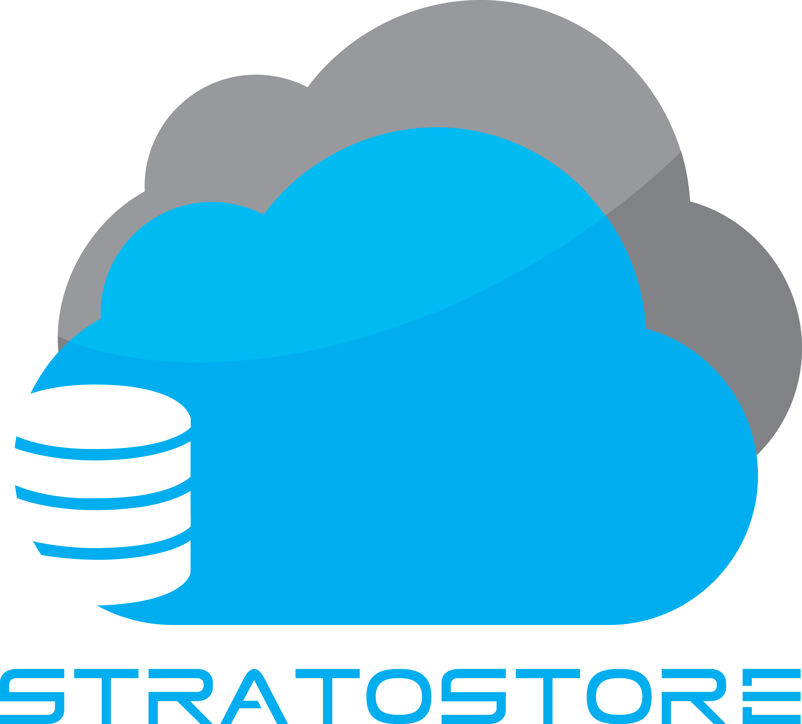
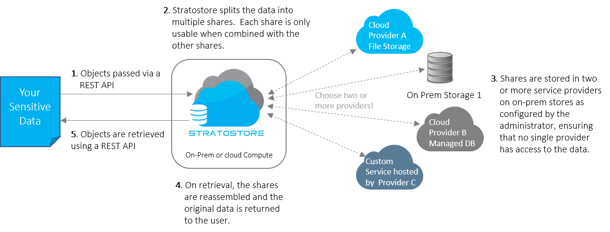
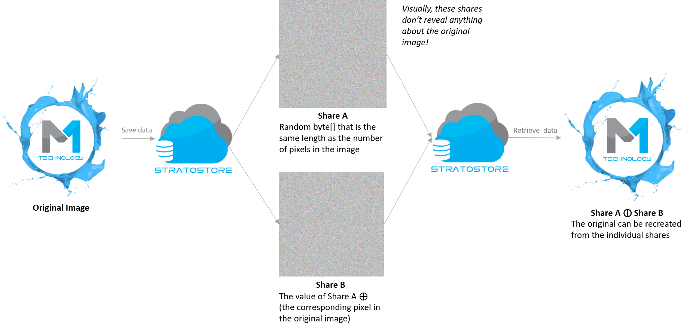

# Stratostore Overview

Stratostore is a solution for storing sensitive data in the cloud.  Stratostore helps you:

- Eliminate the possibility that a cloud administrator can steal your data.
- Prevent a malicious corporate insider from stealing your data.  
- Minimize risks associated with misconfiguration of your data stores. 

## How it works
Stratostore works by using a one-time pad to split your data into “shares” that can be stored across multiple clouds or on premises file stores. 

## Data splitting - a visual Example

# Configuration

TO DO

# About Stratostore
Stratostore is an open source product managed by M1 Technology, LLC.  Please reach out to stratostore@m1technology.com for help implementing Stratostore to protect your sensitive data.
